<!-- ===== CUSTOM ANIMATED HEADER ===== -->

  

---

### `~/ whatIBuild`

I work on the unglamorous-but-hard part of AI: making LLMs reliable on messy, high-stakes documents. Right now that's **regulatory RAG** — querying SOPs, FDA warning letters and GMP rules, where a wrong retrieval isn't a typo, it's a compliance risk. Hierarchical chunking, hybrid retrieval + re-ranking, knowledge-graph gap analysis, agentic pipelines with MCP.

---

### `~/ flagshipProjects`

<table>
<tr>
<td width="50%" valign="top">

#### 🤖 Codeforge-CLI
> *A terminal AI coding agent that fixes its own mistakes.*

A **LangGraph** state machine with a self-validating retry loop — re-runs failing builds automatically until they pass. 5 tools (plan/read/search/edit/shell) with structured error feedback, plus a **tree-sitter** symbol map injected each turn for codebase-aware edits.

`Python` `LangGraph` `OpenRouter` `tree-sitter`

[**→ explore**](https://github.com/aries1232/codeforge-cli)

</td>
<td width="50%" valign="top">

#### 📄 Multi-Model Document Analysis
> *Reading handwritten docs models normally choke on.*

Fine-tuned **YOLOv11** on DocLayNet for complex layout extraction of handwritten text, **SuperGlue** feature matching for accuracy, feeding a PyTorch pipeline that turns unstructured PDFs into structured fields.

`PyTorch` `YOLOv11` `OpenCV` `SuperGlue`

[**→ explore**](https://github.com/aries1232/multi-model-gap-analysis)

</td>
</tr>
</table>

---

### `~/ toolbox`

+ LangChain · LangGraph · MCP · HuggingFace · scikit-learn · Azure AI Search · ChromaDB · Docling · Knowledge Graphs

---

### `~/ theNumbers`

🏆 <b>1529 / 22,866</b> · LeetCode Weekly 450  ·  <b>771 worldwide</b> · CodeChef Starters 122  ·  <b>750+ DSA solved</b>

